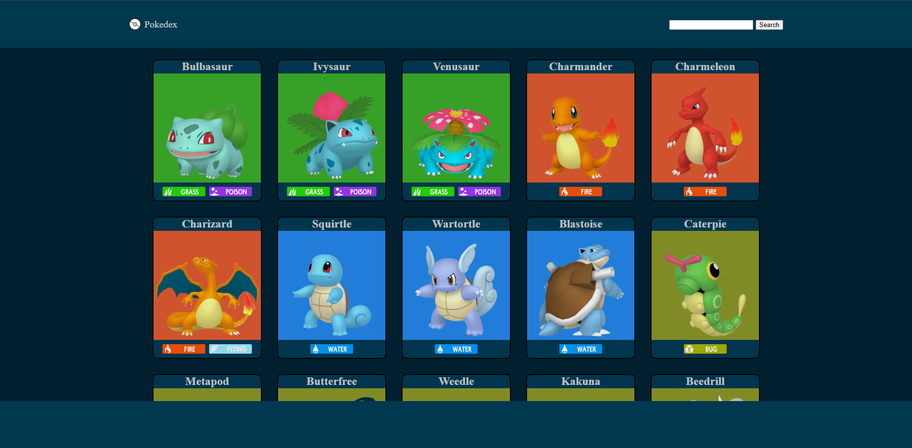
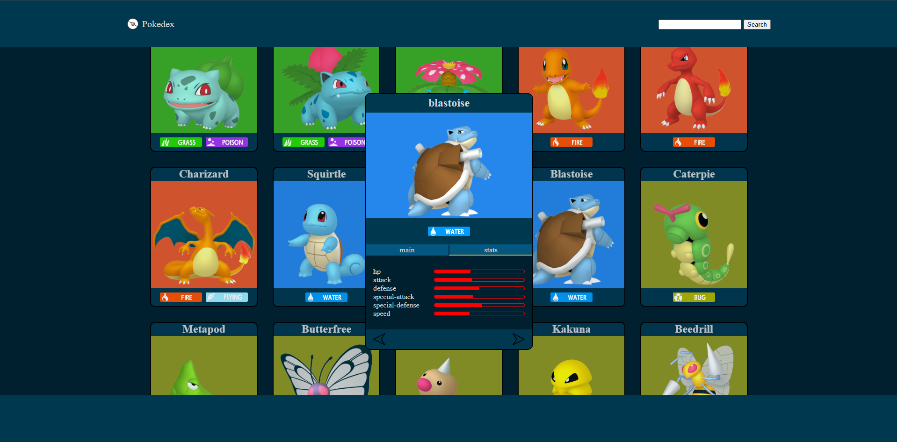
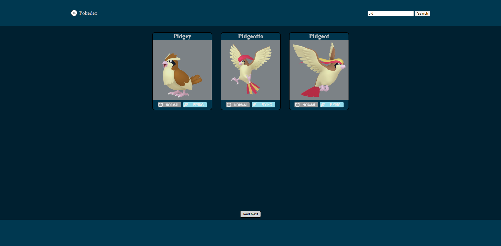

<div align="center">
<h1>Pokédex</h1> 
An interactive Pokédex web application using data from the PokéAPI.  
Browse and search Pokémon while viewing detailed information such as images, types, and stats.
</div>

<h2>Features</h2>

<ul>
  <li>Fetch Pokémon data from the PokéAPI</li>
  <li>Search for Pokémon by name</li>
  <li>Detailed Pokémon stats and information</li>
  <li>Responsive design</li>
  <li>Dynamic rendering with JavaScript</li>
  <li>Modern user interface</li>
</ul>

<h2>Technologies</h2>

<p align="center">
  
  
  
  
  
  
  
</p>

<h2>Preview</h2>

<div align="center" >
  
  
  
</div>

<h2>Live Demo</h2>
<p align="center">
  <a href="https://pokedex.gross-david.de/" target="_blank">
    
  </a>
</p>

<h2>Installation</h2>
<p>Clone the repository:</p>

```bash
git clone https://github.com/DavidGrossDev/pokedex.git
```

<p>
Open the project folder and launch <code>index.html</code> in your browser.
</p>

<h2>Project Structure</h2>

```text
pokedex/
│
├── index.html
├── style.css
├── script.js
├── scripts/
│   ├── bckgrd.js
│   └── templates.js
└── assets/
    ├── img/
    │   ├── arrow.png
    │   └── pokeball.png
    └── screenshots/
        ├── landing.png
        ├── details.png
        └── search.png
```
<h2>What I Learned</h2>
<p>Through this project I improved my skills in:</p>
<ul>
  <li>Working with APIs</li>
  <li>Fetching and handling asynchronous data</li>
  <li>DOM manipulation</li>
  <li>Responsive web design</li>
  <li>JavaScript event handling</li>
  <li>Dynamic UI rendering</li>
</ul>

<h2>API Used</h2>
<p>This project uses the free Pokémon API:</p>
<a href="https://pokeapi.co/">PokéAPI</a>

<h2>Author</h2>
<p>David Groß</p>
<p>GitHub: <a href="https://github.com/DavidGrossDev">DavidGrossDev</a></p>
